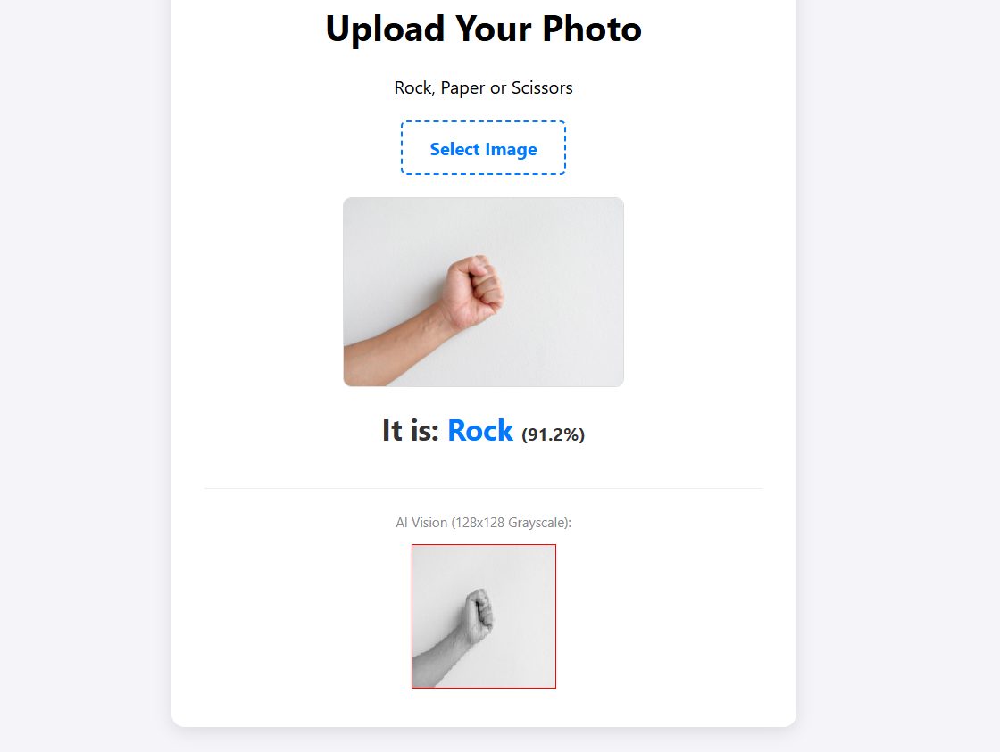

# CNN Rock-Paper-Scissors Classifier

Convolutional Neural Network (CNN) implementation for hand gesture classification, trained in PyTorch and deployed via ONNX Runtime Web.

Demo: https://cnn-rpc-classifier.netlify.app/

## Project Structure

- **model/rock_paper_scissors.onnx**: Trained model weights exported for production use.
- **CNN_rock_paper_scissors.ipynb**: Jupyter Notebook containing training, evaluation, and export logic.
- **index.html**: Client-side web interface for image upload and real-time inference.
- **image.png**: Screenshot of the project environment and directory structure.

## Interface Preview



## Usage

To run the web interface (`index.html`), a local server is required due to browser security restrictions (CORS) regarding ONNX model loading.

1. Open a terminal in the project directory.
2. Launch a local Python server:
   ```bash
   python -m http.server 8000
   ```
